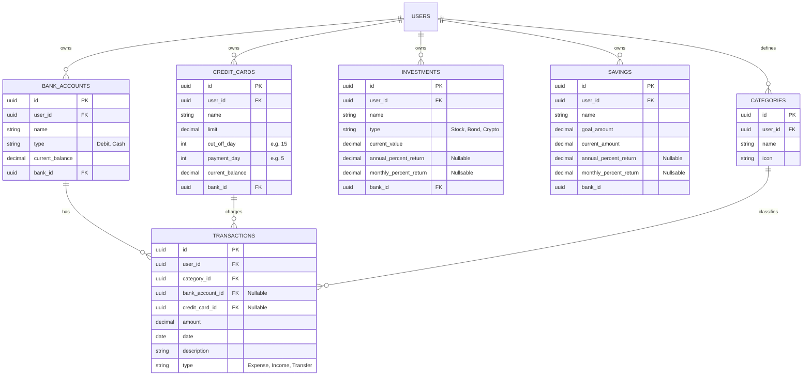

# Databse ER Diagram

```mermaid
erDiagram
    USERS ||--o{ BANK_ACCOUNTS : owns
    USERS ||--o{ CREDIT_CARDS : owns
    USERS ||--o{ INVESTMENTS : owns
    USERS ||--o{ SAVINGS : owns
    USERS ||--o{ CATEGORIES : defines
    BANK_ACCOUNTS ||--o{ TRANSACTIONS : has
    CREDIT_CARDS  ||--o{ TRANSACTIONS : charges
    CATEGORIES    ||--o{ TRANSACTIONS : classifies

    BANK_ACCOUNTS {
        uuid id PK
        uuid user_id FK
        string name
        string type "Debit, Cash"
        decimal current_balance
        uuid bank_id FK
    }

    CREDIT_CARDS {
        uuid id PK
        uuid user_id FK
        string name
        decimal limit
        int cut_off_day "e.g. 15"
        int payment_day "e.g. 5"
        decimal current_balance
        uuid bank_id FK
    }

    INVESTMENTS {
        uuid id PK
        uuid user_id FK
        string name
        string type "Stock, Bond, Crypto"
        decimal current_value
        decimal annual_percent_return "Nullable"
        decimal monthly_percent_return "Nullsable"
        uuid bank_id FK
    }

    SAVINGS {
        uuid id PK
        uuid user_id FK
        string name
        decimal goal_amount
        decimal current_amount
        decimal annual_percent_return "Nullable"
        decimal monthly_percent_return "Nullsable"
        uuid bank_id 
    }

    TRANSACTIONS {
        uuid id PK
        uuid user_id FK
        uuid category_id FK
        uuid bank_account_id FK "Nullable"
        uuid credit_card_id FK "Nullable"
        decimal amount
        date date
        string description
        string type "Expense, Income, Transfer"
    }

    %% TODO: CATEGORIES should be linked to a single user
    CATEGORIES {
        uuid id PK
        uuid user_id FK
        string name
        string icon
    }
```